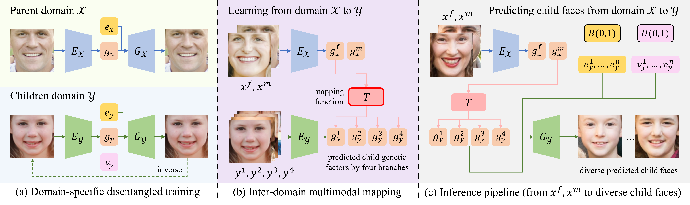
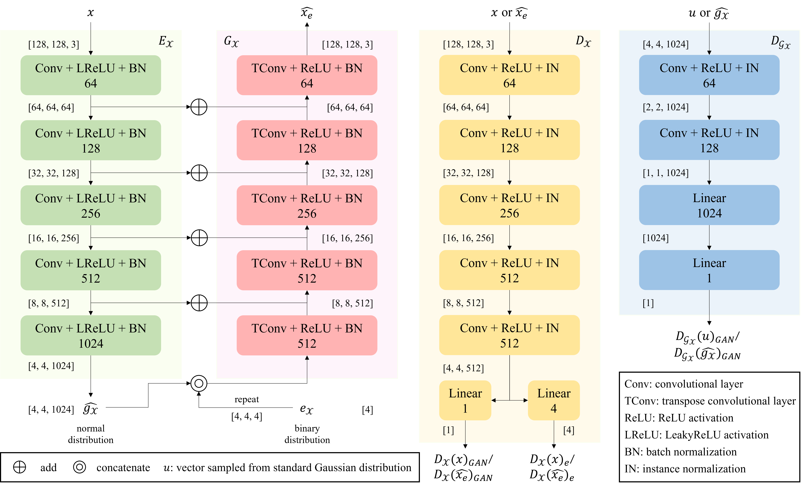
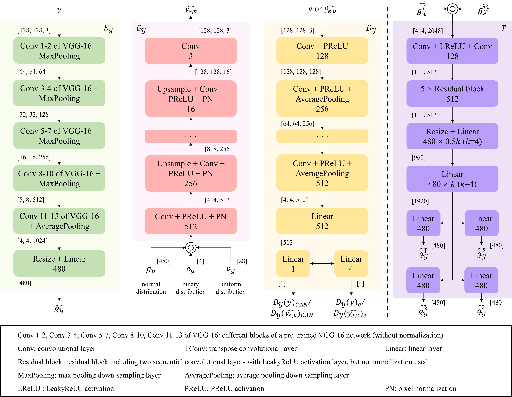

# ChildPredictor

This is the official webpage of the paper "ChildPredictor: A Child Face Prediction Framework with Disentangled Learning", accepted to IEEE TMM, 2022

Arxiv: https://arxiv.org/abs/2204.09962

IEEE Xplore: https://ieeexplore.ieee.org/document/9749880

:rocket:  :rocket:  :rocket: **News**:

- **May. 19, 2022**: We release the data of the FF-Database, please see section 1.1 for the terms of use.

- **Apr. 15, 2022**: We release the pre-trained models with validation samples for ChildPredictor.

- **Mar. 31, 2022**: The paper is accepted by the IEEE Transactions on Multimedia.

- **Feb. 8, 2022**: We release the code for ChildPredictor. We are considerring to release the original data of the collected FF-Database.

## 1 FF-Database

### 1.1 Data Download

If you would like to download the FF-Database data, please fill out an agreement to the [FF-Database Terms of Use](./FF-Database-TOU.pdf) and send it to us at yzzhao2-c@my.cityu.edu.hk.

Please use the institutional email instead of anonymous addresses such as Gmail, QQMail, and hotmail. Make sure your email address is the same as it in the **FF-Database Terms of Use**.

### 1.2 Overview

The data collection pipeline is shown as follows:


Some families are shown as follows:


## 2 Results on Real Families

The generated results on the collected FF-Database:


The generated results on other datasets:


The disentangled learning analysis is as:


The ablation study is as:


## 3 Implementation

### 3.1 File Structure

Some files are not included in the current implementation since they are too large. The network architectures can be found in the ``code`` folder.

```
code
│
└───baby_model_pool
│   └───attgan
│   │   │   attgan_without_claloss_baby.pth
│   │   │   attgan_without_ganloss_celeba_baby.pth
│   │   │   attgan_without_ganloss_claloss_celeba_baby.pth
│   │   │   ...
│   └───inverse
│   │   │   Inverse_ProGAN_GAN_ACGAN_start-with-code.pth
│   │   │   Inverse_ProGAN_GAN_MSGAN_ACGAN_start-with-code.pth
│   │   │   Inverse_ProGAN_GAN_MSGAN_ACGAN_start-with-image.pth
│   │   │   ...
│   └───mapping
│   │   └───Mapping_Xencoder_full_ProGAN_GAN_MSGAN_ACGAN_deepArch_multi-gt_v4
│   │   │   │   MappingNet_Batchsize_32_Epoch_298.pth
│   │   └───Mapping_Xencoder_full_ProGAN_GAN_deepArch_multi-gt_v4
│   │   │   │   MappingNet_Batchsize_32_Epoch_298.pth
│   │   └───Mapping_Xencoder_wo-class_ProGAN_GAN_MSGAN_deepArch_multi-gt_v4
│   │   │   │   MappingNet_Batchsize_32_Epoch_298.pth
│   │   │   ...
│   └───ProGAN-ckp
│   │   │   ProGAN_pt_mixtureData_GAN.pth
│   │   │   ProGAN_pt_mixtureData_GAN_ACGAN.pth
│   │   │   ProGAN_pt_mixtureData_GAN_MSGAN.pth
│   │   │   ProGAN_pt_mixtureData_GAN_MSGAN_ACGAN.pth
│   │   │   ...
│
└───babyinverse (Ey)
│   │   ...
|
└───babymapping_1219 (T)
│   │   ...
│
└───Datasets
│   │   ...
│
└───ProGAN (Gy)
│   │   ...
│
└───AttGAN (please refer to AttGAN official webpage)
│   │   ...
│   
```

### 3.2 Required Libraries

The implementation is based on CUDA 9.0 and PyTorch 1.1.0. The following packages are needed to be installed:

```bash
pytorch==1.1.0
torchvision==0.3.0
tensorflow-gpumkdir ./babymapping_1219/Models/pretrain
mv ./baby_model_pool/ProGAN-ckp/* ./babymapping_1219/Models/pretrain/
tensorboardx
pyyaml
tqdm
easydict
```

### 3.3 Testing a Real Face

First, download the pre-trained models from this [link](https://portland-my.sharepoint.com/:f:/g/personal/yzzhao2-c_my_cityu_edu_hk/EoJ0dSnBBgNPnJtCGz108aMBexjNuPU4aF7ePBCzP_yEcQ?e=fkHLuF). It should be a large zip file with size of approximately 3.9 Gb.

After you have already downloaded the pre-trained models, enter `code` folder and unzip all the models under the **./code/baby_model_pool** folder:

```
cd code
mkdir baby_model_pool
cd baby_model_pool
unzip Onedrive_baby_model_pool.zip
cd ..
```

Then, you need to move all the ProGAN pre-trained models under another path:

```
mkdir ./babymapping_1219/Models/pretrain
mv ./baby_model_pool/ProGAN-ckp/* ./babymapping_1219/Models/pretrain/
```

Next, you can test some validation samples (we have already put some examples under the **code/babymapping_1219** folder):

```bash
cd babymapping_1219
python main.py
```

If you want to change the input images, see lines 38-39 of **validation.yaml**: https://github.com/zhaoyuzhi/ChildPredictor/blob/main/code/babymapping_1219/yaml/yaml/validation.yaml#L38-L39

### 3.4 Training

Currently, we do not release the full codes for training due to privacy issue.

### 3.5 Build Your Own Dataset

Please refer to **code_FFDatabase_collection**.

## 4 Network Architectures







## 5 Some Related Works

- Zaman, Ishtiak and Crandall, David. Genetic-GAN: Synthesizing Images Between Two Domains by Genetic Crossover. European Conference on Computer Vision Workshops, 312--326, 2020.

- Gao, Pengyu and Robinson, Joseph and Zhu, Jiaxuan and Xia, Chao and Shao, MIng and Xia, Siyu. DNA-Net: Age and Gender Aware Kin Face Synthesizer. IEEE International Conference on Multimedia and Expo (ICME), 2021.

- Robinson, Joseph Peter and Khan, Zaid and Yin, Yu and Shao, Ming and Fu, Yun. Families in wild multimedia (FIW MM): A multimodal database for recognizing kinship. IEEE Transactions on Multimedia, 2021.

## 6 Citation

If you find this work useful for your research, please cite:

```bash
@article{zhao2022childpredictor,
  title={ChildPredictor: A Child Face Prediction Framework with Disentangled Learning},
  author={Zhao, Yuzhi and Po, Lai-Man and Wang, Xuehui and Yan, Qiong and Shen, Wei and Zhang, Yujia and Liu, Wei and Wong Chun-Kit and Pang, Chiu-Sing and Ou, Weifeng and Yu, Wing-Yin and Liu, Buhua},
  journal={IEEE Transactions on Multimedia},
  year={2022}
}
```

Please contact yzzhao2-c@my.cityu.edu.hk for further questions.
